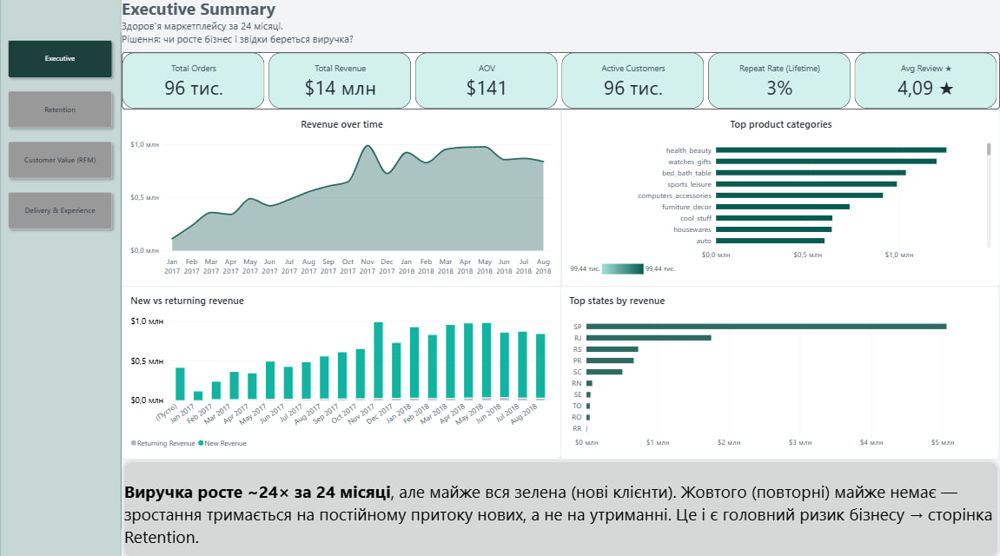
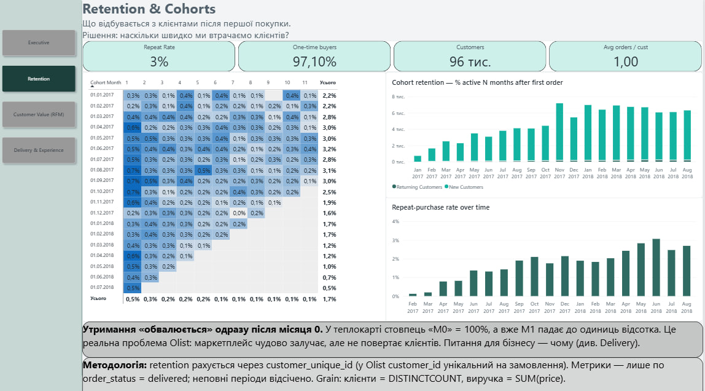
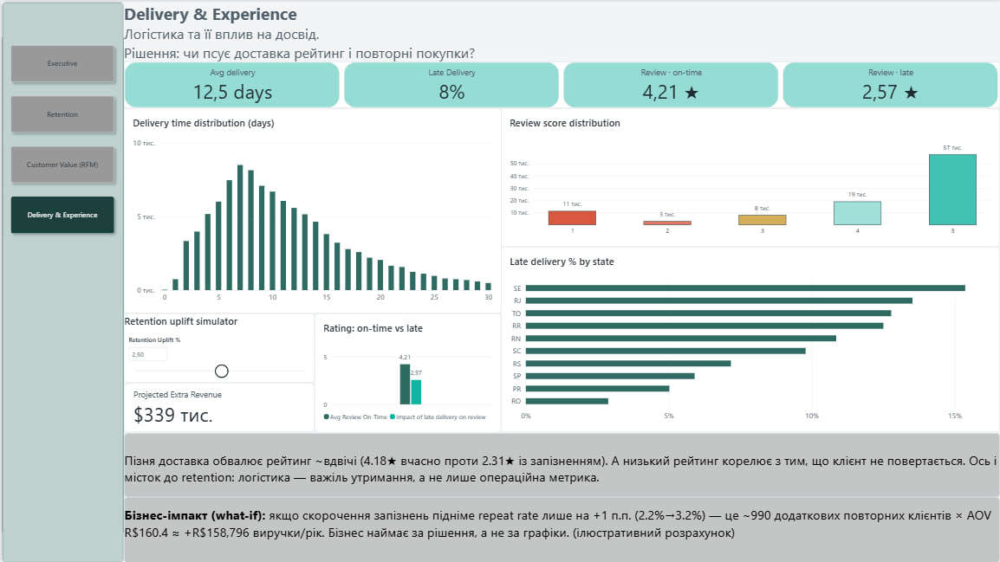
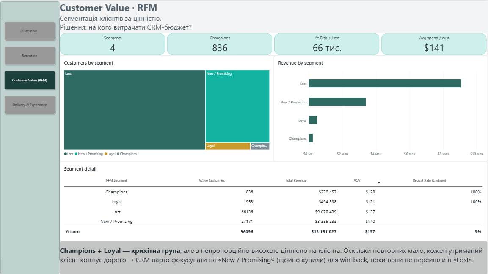
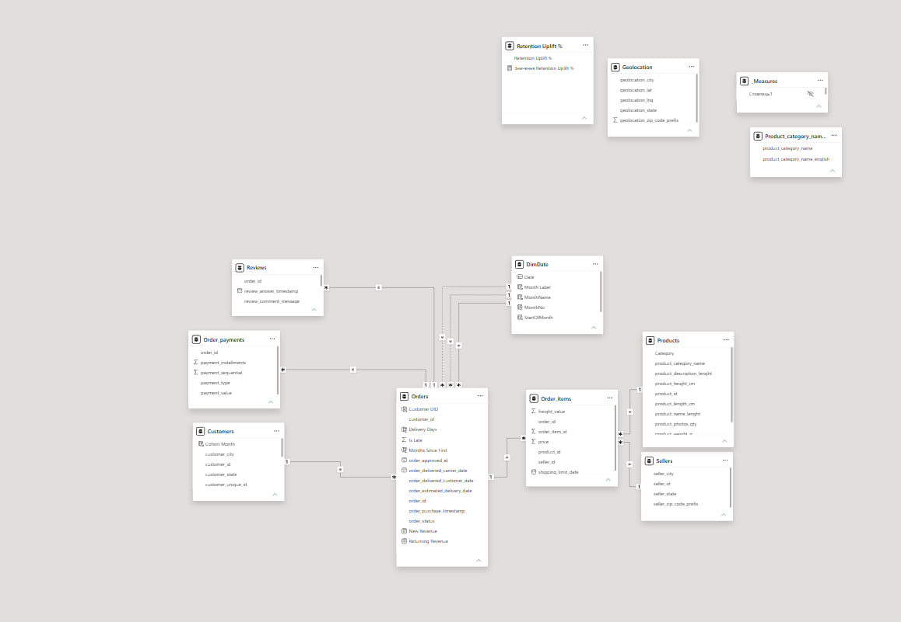

# Olist — аналіз утримання клієнтів (Power BI)

Дашборд по бразильському маркетплейсу **Olist**. Робив його, щоб розібратися не з питанням «скільки продали», а з набагато незручнішим — **чому клієнти не повертаються**. Спойлер: майже 97% купують один раз і зникають, і весь проєкт крутиться навколо того, щоб зрозуміти, чому так і що з цим можна зробити.

Дані — публічний [Brazilian E-Commerce Public Dataset by Olist](https://www.kaggle.com/datasets/olistbr/brazilian-ecommerce) (~99 тис. замовлень, 2016–2018, 9 таблиць).



## Що я хотів зрозуміти

Коли дивишся на Olist поверхнево — усе добре: виручка росте, замовлень багато, середній рейтинг ~4. Але щойно порахуєш retention, картина інша. Я поставив чотири рішеннєві питання, під кожне — окрема сторінка:

- Виручка росте за рахунок нових клієнтів чи повторних?
- Наскільки швидко ми втрачаємо клієнта після першої покупки?
- Які сегменти реально приносять гроші і кого варто рятувати?
- Чи псує пізня доставка рейтинг і повернення?

## Головні знахідки

**Зростання тримається виключно на нових клієнтах.** На сторінці Executive виручка виросла ~24× за два роки, але якщо розкласти на «нові vs повторні» — повторних майже немає. Бізнес не нарощує базу, а постійно її переповнює новими людьми.

**Retention обвалюється одразу після місяця 0.** Когортна теплокарта — головний візуал: M0 = 100%, а вже M1 — це десяті частки відсотка. Lifetime repeat rate вийшов ~3%, у середньому 1,02 замовлення на клієнта. Це не «є куди рости» — це структурна проблема продукту.



**Пізня доставка — недооцінений важіль.** Вчасні замовлення дають середній рейтинг **4,2★**, пізні — **2,6★**, майже вдвічі менше. Низький рейтинг корелює з невповерненням, а запізнення концентруються у віддалених штатах (SE ~15%) проти SP (~6%). Тобто логістика тут не операційна дрібниця, а важіль утримання.



**Цінних клієнтів мало, але вони варті уваги.** RFM показав, що Champions + Loyal разом — менше 3 тис. із 96 тис. клієнтів, зате з найвищим чеком на людину. Основна маса — Lost і New/Promising. Висновок для CRM: ловити «New/Promising» одразу після першої покупки, поки вони не з'їхали в «Lost».



## Як це зроблено

Класична зіркова схема: факт `OrderItems` (ціна, доставка) навколо вимірів — `Customers`, `Products`, `Sellers`, `Reviews`, `DimDate`. Окрема таблиця `_Measures`, зв'язки `*:1`, без двонаправлених фільтрів.



Кілька рішень, які варто пояснити:

- **`DimDate` — role-playing dimension.** У замовлення три дати (покупка / доставка / очікувана). Замість трьох календарів — один `DimDate` з активним зв'язком по даті покупки і двома неактивними, які вмикаю через `USERELATIONSHIP`, коли треба дивитись по даті доставки.
- **Retention рахую тільки через `customer_unique_id`.** Головна пастка Olist: `customer_id` генерується під кожну транзакцію, тож якщо рахувати по ньому — repeat rate вийде 0%. Реальний клієнт живе в `customer_unique_id`, і всі lifetime-метрики я рахую через нього (`ALLEXCEPT`).
- **Аналітичне вікно Jan 2017 – Aug 2018.** 2016-й і кінець 2018-го обрізав — неповні дані, які інакше псують тренди й когорти. Усі метрики виручки/утримання — лише по `order_status = "delivered"`.

Приклад ключової міри — індекс когорти:

```dax
-- calc column на Orders: скільки місяців від першої покупки клієнта
Months Since First =
DATEDIFF (
    RELATED ( Customers[Cohort Month] ),
    DATE ( YEAR ( Orders[order_purchase_timestamp] ), MONTH ( Orders[order_purchase_timestamp] ), 1 ),
    MONTH
)
```

Ще є RFM-сегментація (R/F/M бали + `SWITCH`), what-if параметр для оцінки грошового ефекту від зростання retention, і time intelligence для YoY.

## Граблі, на які я наступив

Чесно, більшість часу пішла не на візуали, а на дані. Що ловив:

- **Repeat rate = 0.** Спочатку рахував по `customer_id` — усі клієнти виглядали як разові. Довелося розібратися зі структурою Olist і перейти на `customer_unique_id`.
- **Уся виручка провалилась у «(Blank)» на графіку по датах.** Ключ `order_purchase_timestamp` був DateTime із часом, а `DimDate[Date]` — Date; час ламав збіг у зв'язку. Обрізав час до Date — запрацювало.
- **`SUM cannot work with String`.** Прапорець `Is Late` створився як текст, не число. Дрібниця, але звалила візуал.
- **Міра не реагувала на когортні стовпці** — фільтр односторонній і не доходив від Orders до Customers. Виніс `customer_unique_id` у факт через `RELATED`.
- **Локалізаційна каша.** Осі показували російські місяці й символ ₽ через локаль файлу. Оскільки мову моделі не змінити в наявному звіті, зафіксував примусово через `FORMAT(StartOfMonth, "MMM yyyy", "en-US")` і явний формат `$` для мір.

Нічого екзотичного, але саме такі речі відрізняють «зробив по туторіалу» від «розібрався з реальними даними».

## Що зробив би далі

- **RLS** — роль регіонального менеджера з фільтром по `customer_state` (динамічно через `USERPRINCIPALNAME()`).
- **Incremental refresh** на факті — на реальних обсягах повне оновлення довге.
- **Аудит моделі** в DAX Studio / VertiPaq Analyzer — кардинальність і розмір колонок.
- Публікація в Power BI Service зі scheduled refresh, версіонування через PBIP + Git.

## Стек
Power BI Desktop · Power Query (M) · DAX · зіркова схема · What-if параметр · (планово) RLS

## Дані
Brazilian E-Commerce Public Dataset by Olist — Kaggle, публічний. У репозиторії — `.pbix` та скріншоти сторінок. Щоб оновити — завантаж 9 CSV із Kaggle.

---
*Автор: Максим Домантович · 1maksdom@gmail.com
